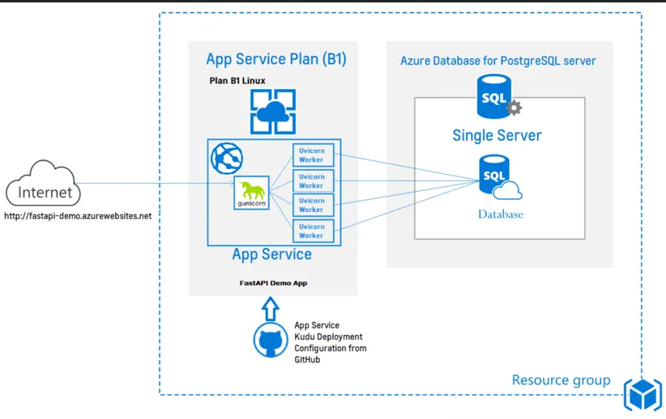
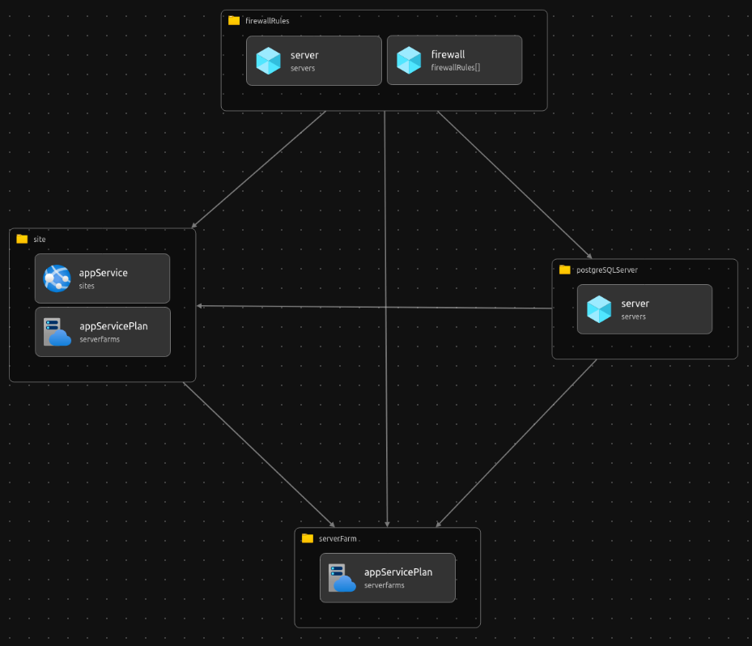

# social-media-api 

A social media API that manages user account creation with access tokens, post creation, update, and deletion, as well as upvotes and downvotes. Built with FastAPI and powered by a Postgres database. The cloud infrastructure is built with Bicep.
## Read the Docs

[social-media-api.azurewebsites.net/docs](https://social-media-api.azurewebsites.net/docs)

# Architectural Overview of Deploying on Azure App Service
The request is received by [Gunicorn](http://gunicorn.org/) which spwans the FastAPI running on four child workerprocesses with the help of Asynchronous [Uvicorn Worker Class](https://www.uvicorn.org/#running-with-gunicorn). Each of the Uvicorn [worker class](https://docs.gunicorn.org/en/stable/settings.html#worker-class) runs FastAPI app on a randomly chosen process id (pid) and the request delegation is handled by the Gunicorn that runs on a process id that can be configured to run on specified port.

The web request is delegated to one of the instance of the FastAPI application that is available among these worker processes. All the four instances in this setup will talk to the same database created in the **Azure Database for PostgreSQL Server.**



The App service deployment configuration will detect any changes to the GitHub repository it is configured with. The deployment configuration with **Kudu** pulls and deploys the code to the App Service automatically.

# Cloud Infrastructure

Used **Bicep** for  Infrastructure as Code (IaC) 

**Bicep** is a **domain-specific language** (DSL) that uses declarative syntax to deploy Azure resources. In a Bicep file, you define the infrastructure you want to deploy to Azure, and then use that file throughout the development lifecycle to repeatedly deploy your infrastructure. Your resources are deployed in a consistent manner.

- **Cloud Infrastructure visualization**




# Installation

1. Navigate into your desired folder, then clone this repository  as shown, remember the dot (.) so as to avoid duplicating this repository name again.

    `https://github.com/flavian-anselmo/social-media-api.git .`

1. Change to that specific directory

    `cd directory path`

1. Install the requirements from the requirements.txt file.

    `pip install -r requirements.txt`

1. Create a `.env` file in the root of the directory then add the following contents, adding values for each depending on your configs.

    ```
    DATABASE_HOSTNAME=
    DATABASE_PORT=
    DATABASE_PASSWORD=
    DATABASE_NAME=
    DATABASE_USERNAME=
    SECRET_KEY=     #jwt auth -> random alphanumeric  
    ALGORITHM=HS256

    ```

1. Run a database migration

    `alembic upgrade head`

1. Start the server

    `uvicorn app.main:app --reload`
# e-citizen-api
